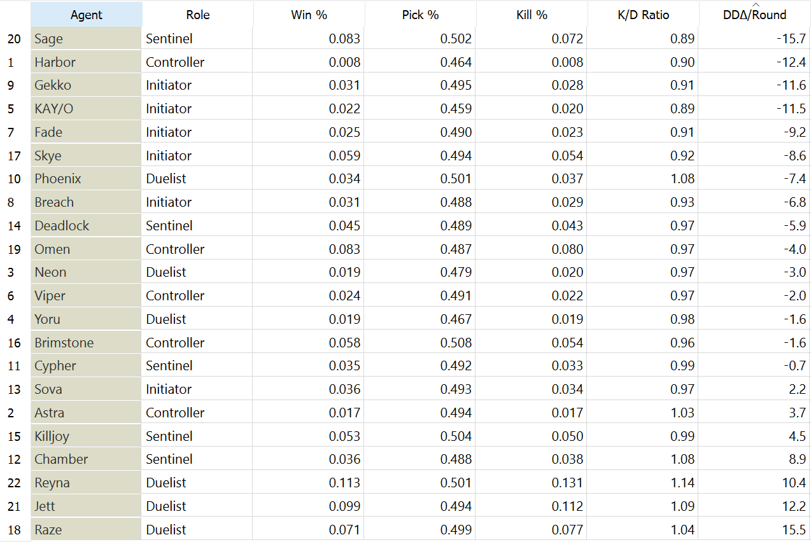
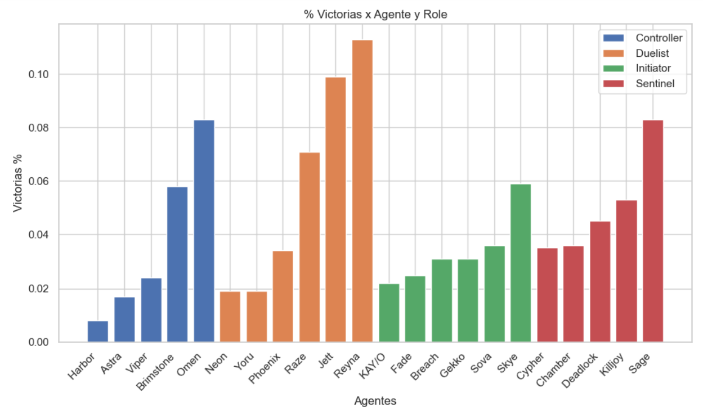
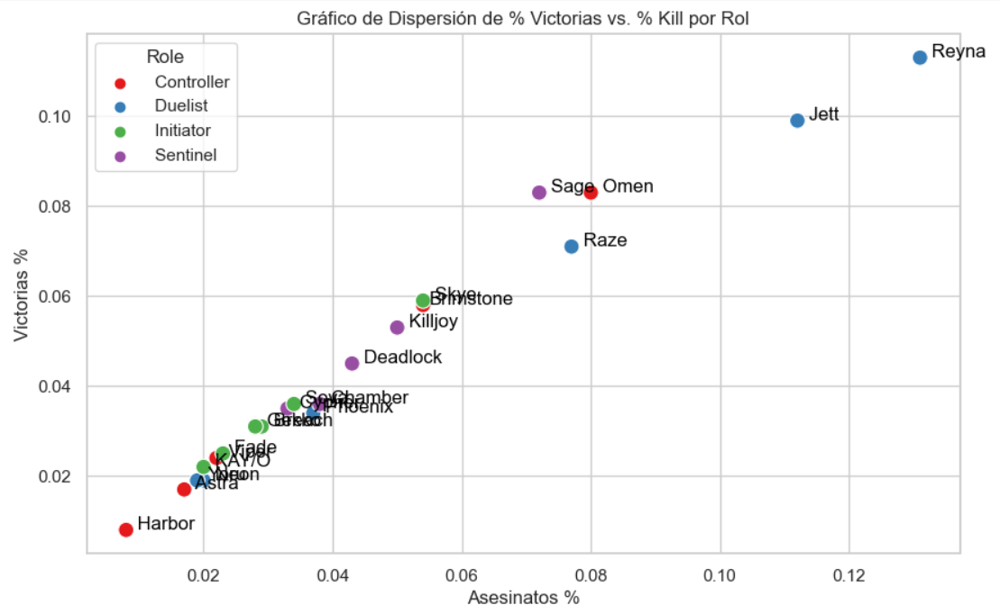

# Henrysie19.github.io
Valorant Analisis
Aqui podras visualizar el analisis de los datos del juego VALORANT

En el emocionante mundo de Valorant, cada agente aporta su propio conjunto de habilidades y características únicas al campo de batalla táctico. Para llevar a cabo un análisis exhaustivo y revelador sobre el rendimiento de estos agentes, se ha desarrollado una herramienta innovadora que combina web scraping y visualización de datos.

  
Esta creación comienza por extraer datos en tiempo real de la página oficial de Valorant, utilizando técnicas de web scraping para acceder a información detallada sobre cada uno de los agentes. Estos datos incluyen estadísticas vitales como tasas de selección en partidas, tasas de victoria, roles, promedio de eliminaciones por partida y más. Al recopilar estos datos, se obtiene una visión actualizada de cómo se desempeñan los agentes en el entorno competitivo.
  

  
El siguiente paso es transformar estos datos en visualizaciones claras y efectivas. Mediante el uso de gráficas de barras, se pueden comparar fácilmente las tasas de selección y victoria de cada agente. Esto proporciona una perspectiva instantánea sobre cuáles agentes son los más populares y cuáles tienen un historial exitoso en términos de victorias. La longitud de las barras refleja la popularidad y el éxito relativo de cada agente, permitiendo a los jugadores identificar tendencias y preferencias en la comunidad.
  

  
El siguiente paso es transformar estos datos en visualizaciones claras y efectivas. Mediante el uso de gráficas de barras, se pueden comparar fácilmente las tasas de selección y victoria de cada agente. Esto proporciona una perspectiva instantánea sobre cuáles agentes son los más populares y cuáles tienen un historial exitoso en términos de victorias. La longitud de las barras refleja la popularidad y el éxito relativo de cada agente, permitiendo a los jugadores identificar tendencias y preferencias en la comunidad.
  

Esta creación de análisis de datos sobre los agentes en Valorant combina habilidades técnicas como web scraping con visualización de datos para ofrecer a los jugadores una visión profunda y objetiva del desempeño de cada agente. Al identificar patrones y tendencias a través de gráficas de barras y gráficos de dispersión, los jugadores pueden tomar decisiones informadas sobre qué agentes jugar y cómo mejorar su rendimiento en el campo de batalla. ¡Esta herramienta se convierte en un aliado invaluable para aquellos que buscan dominar el juego y destacar en el competitivo mundo de Valorant!

